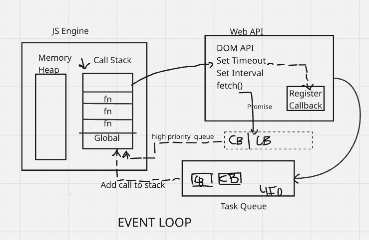

## Javascript

- Synchronous
- Single-threaded

These are the default behaviours

### Blocking code vs Non-blocking code

- Block the flow of program —> Read file sync
- Does not block the execution —> Read file async

It depends on the use case which version to use when

1,  settimeout(0)2 , 3 —> It prints 1, 3, 2

Three printed before 2 because 2 has to go through the event loop, which takes time to print.