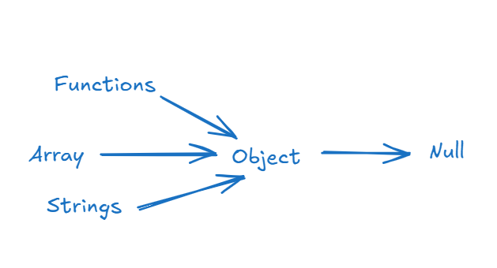
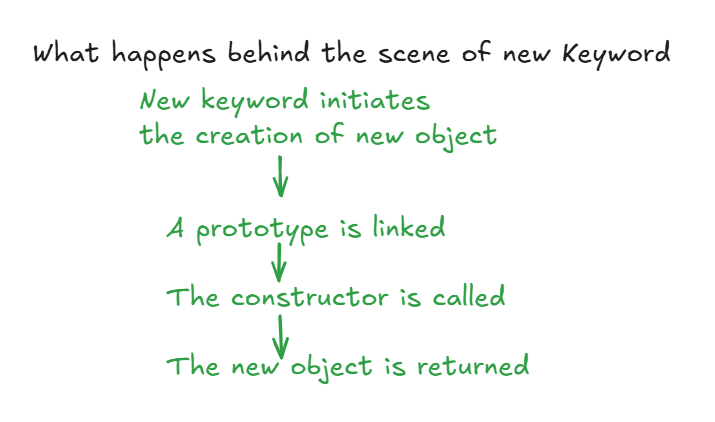

## Object Oriented in JavaScript

#Javascript and classes 
- Prototype based language
- Even with the introduction of the ```class``` keyword in ES6, it remains syntactic sugar over Javascript's existing prototype-based inheritance

## Object
- collection of properties and methods
- e.g ```toLowerCase()``` is built-in method belonging to the string object prototype.

# why use OOP?
- Modularity
- Reusability: avoids repeating via inheritance and constructor functions
- Maintainability

## ---Parts of OOP---

# Object literal
 It is a direct way to define a single object using {}
```js
const user = {
    username: 'amna',
    loginCount: 8,
    signedIn = true,

    getUserDetails: function(){
        console.log('Got user details from database');
    }
}

console.log(user.username);
console.log(user.getUserDetails());

```

# Constructor function
Allows us to create blueprints for generating multiple objects of the same structure
```js
const date = new Date() // here new refers to constructor function, helps us to make new context

function User(username, loginCount, isloggedIn){
    this.username = username;
    this.loginCount = loginCount;
    this.isloggedIn = isloggedIn

    //we can add methods as well
    this.greeting = function(){
        console.log(`Welcome ${this.username}`);
    }

    return this; // if not written, it implicitly returns this
}

const user1 = User('Amna', 12, true)
const user2 = User('Aisha', 11, false)
console.log(user1) // here the user2 overwrites the values of user1

const user1 = new User('Amna', 12, true)
const user2 = new User('Aisha', 11, false)
console.log(user1) //now because of new keyword the user2 don't overwrite the user1
```
# Prototypes and Prototypal Inheritance
In javascript everything (functions, arrays, strings) eventually behavees like or traces back to an Object. Because functions are objects, they can also have properties attached to them.
```js
function mulby5(num){
    return num*5;
}

mulby5.power = 2 // functions can hold properties
console.log(mulby5(5)) //25
console.log(mulby5.power) //2
console.log(mulby5.prototype) // returns an empty obj layer available to attach methods
```


# Injecting Custom Prototpye Methods\

```js
function createUser(username, score){
    this.username = username
    this.score = score
}

createUser.prototype.increment = function(){
    this.score++; //this refers to current context
}

createUser.prototype.printMe = function(){
    console.log(`score is ${this.score}`); //this refers to current context
}

const a = new createUser('A', 20); // without new keyword it'll not work
const b = new createUser('B', 15);

a.printMe(); // score is 20
```

# Extending Native Prototypes
We can dynamically add methods directly to global objects like ```String``` or ```Array```

```js
let myName = 'Amna'
console.log(myName.length)

String.prototype.trueLength = function(){
    console.log(`${this}`)
    console.log(`True length is: ${this.trim().length}`)
}

myName.trueLength()
"iceTea".trueLength()

```

# Modern Prototype Linking
Instead of using the older __proto__ syntax, modern JavaScript handles prototype inheritance using standard Object methods.

Object.setPrototypeOf() --> modern syntax 
```js
const Teacher = { makeVideo: true };
const TeachingSupport = { isAvailable: false };

const TAsupport = {
    makeAssignment: 'JS Assignment',
    fullTime: true,
};

// Modern Syntax to inherit properties
Object.setPrototypeOf(TAsupport, TeachingSupport); 
console.log(TAsupport.isAvailable); // false (inherited from TeachingSupport)
```

New Keyword


## 4 pillars
- Abstraction --> hiding implementation (compllexity), only exposing the essential features.
- Encapsulation --> Data hiding, it prevents outside code from accidentally modifying internal data.
- Inheritance --> Reusability, allows a new class to adopt the properties and methods of an existing class.
- Polymorphism --> Allows different classes to be treated as instances of the same parent class, while still maintaining their own unique behaviour.

